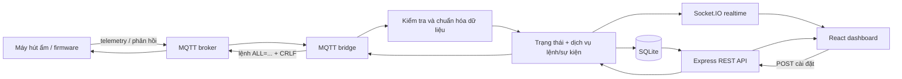
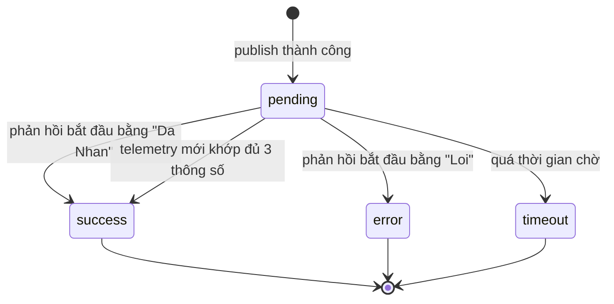

# Lộ trình kiến thức để làm chủ dự án NhietAmMqtt

> Mục tiêu của tài liệu: giúp một người đi từ mức **đọc và giải thích được mã nguồn**, qua mức **tự viết lại từng phần**, đến mức **tự phân tích, thiết kế, hoàn thành và vận hành một dự án tương đương**.
>
> Phạm vi được rút ra trực tiếp từ mã nguồn hiện tại và tài liệu `banTinModbus.docx`, không phải một lộ trình web chung chung.

## 1. Sau khi học xong, bạn cần làm được gì?

Bạn được xem là đã làm chủ dự án khi có thể tự thực hiện toàn bộ chuỗi sau:

1. Đọc dữ liệu nhiệt độ, độ ẩm và trạng thái do thiết bị gửi lên MQTT broker.
2. Kiểm tra, chuẩn hóa và chuyển bản tin thô thành dữ liệu TypeScript tin cậy.
3. Xác định thiết bị online/offline và phát hiện các thay đổi như đầy khay nước, lỗi cảm biến, xả đá.
4. Lưu telemetry, lệnh điều khiển và sự kiện vào SQLite.
5. Cung cấp REST API cho dữ liệu ban đầu và Socket.IO cho cập nhật thời gian thực.
6. Hiển thị dashboard React, biểu đồ lịch sử, cảnh báo và nhật ký.
7. Nhận thông số người dùng nhập, kiểm tra hợp lệ, tạo lệnh ASCII có `\r\n`, publish xuống thiết bị và theo dõi phản hồi hoặc timeout.
8. Viết kiểm thử, xử lý lỗi, bảo vệ thông tin kết nối và triển khai hệ thống an toàn.

## 2. Bức tranh tổng thể của hệ thống



Điểm quan trọng nhất cần hiểu: dự án có **ba kiểu giao tiếp khác nhau**.

| Giao tiếp | Nơi sử dụng | Mục đích |
| --- | --- | --- |
| MQTT | Thiết bị ↔ backend | Telemetry, lệnh điều khiển và phản hồi thiết bị |
| HTTP/REST | Frontend ↔ backend | Lấy trạng thái ban đầu, lịch sử và gửi yêu cầu cài đặt |
| Socket.IO | Backend → frontend | Đẩy telemetry, trạng thái, lệnh và sự kiện theo thời gian thực |

Không nên nhầm Socket.IO với MQTT: trình duyệt không kết nối trực tiếp thiết bị. Backend đóng vai trò cầu nối và biên bảo vệ dữ liệu.

## 3. Bản đồ mã nguồn nên biết

| Tệp/thư mục | Trách nhiệm chính | Kiến thức cần có |
| --- | --- | --- |
| `package.json` | npm workspaces và lệnh chạy toàn dự án | npm, script, monorepo |
| `.env.example` | Cấu hình broker, topic, cổng và database | biến môi trường, secret, cấu hình theo môi trường |
| `backend/src/config/env.ts` | Đọc và kiểm tra `.env` bằng Zod | Node.js, URL/path, Zod |
| `backend/src/mqtt/telemetry-schema.ts` | Parse, sửa JSON cũ và ánh xạ telemetry | JSON, regex, schema validation, type |
| `backend/src/mqtt/mqtt-client.ts` | Kết nối, subscribe và phân loại bản tin MQTT | MQTT, event-driven programming, reconnect |
| `backend/src/state/device-state.ts` | Lưu snapshot hiện tại và tính online/offline | class, thời gian, state model |
| `backend/src/commands/command-service.ts` | Tạo lệnh, chờ ACK, đối chiếu telemetry và timeout | state machine, Promise, timer, protocol |
| `backend/src/events/event-service.ts` | Chỉ phát sự kiện khi trạng thái thay đổi | snapshot, transition, domain logic |
| `backend/src/database/database.ts` | Schema, prepared statement, truy vấn và giảm số điểm | SQL, SQLite, WAL, index, downsampling |
| `backend/src/index.ts` | Ghép Express, Socket.IO, MQTT, database và service | kiến trúc backend, dependency wiring |
| `frontend/src/App.tsx` | Toàn bộ dashboard và luồng dữ liệu phía trình duyệt | React hooks, fetch, Socket.IO client, form, SVG |
| `frontend/src/styles.css` | Bố cục, responsive và trạng thái trực quan | CSS Grid/Flexbox, media query, accessibility |
| `banTinModbus.docx` | Đặc tả MQTT hiện tại và nhánh Modbus RTU | giao thức thiết bị, ASCII/CRLF, register/CRC |

## 4. Thứ tự đọc mã hiệu quả

Đọc theo thứ tự sau, mỗi tệp phải trả lời được câu hỏi bên cạnh trước khi chuyển tiếp:

1. `README.md`: hệ thống dùng topic nào, chạy bằng lệnh nào?
2. `.env.example`: giá trị nào thay đổi giữa máy phát triển và môi trường thật?
3. `telemetry-schema.ts`: bản tin firmware biến thành đối tượng nội bộ như thế nào?
4. `device-state.ts`: tại sao broker connected chưa chắc thiết bị online?
5. `event-service.ts`: tại sao không ghi cảnh báo lặp lại sau mỗi 5 giây?
6. `command-service.ts`: lệnh đi qua các trạng thái `pending`, `success`, `error`, `timeout` ra sao?
7. `mqtt-client.ts`: backend phân biệt JSON telemetry với chuỗi phản hồi trên cùng topic thế nào?
8. `database.ts`: dữ liệu được lưu, truy vấn và giảm xuống tối đa 240 điểm ra sao?
9. `index.ts`: các module được nối với nhau và phát event Socket.IO ở đâu?
10. `App.tsx`: dữ liệu ban đầu từ REST được kết hợp với dữ liệu realtime như thế nào?
11. `styles.css`: giao diện thay đổi ra sao ở các mốc 1250, 1100, 900 và 640 px?

## 5. Hợp đồng dữ liệu phải thuộc

### 5.1. Topic MQTT

| Mục đích | Topic mặc định | Chiều dữ liệu |
| --- | --- | --- |
| Telemetry | `mayhutam1/nhan` | Thiết bị → backend |
| Lệnh cài đặt | `mayhutam1/caidat` | Backend → thiết bị |
| Phản hồi lệnh | `mayhutam1/nhan` | Thiết bị → backend |

Telemetry và phản hồi đang dùng chung topic. Backend phân loại bằng nội dung: chuỗi bắt đầu bằng `{` được xem là telemetry; `Da Nhan` hoặc `Loi` được xem là phản hồi lệnh.

### 5.2. Ánh xạ telemetry

| Trường firmware | Trường nội bộ | Ý nghĩa |
| --- | --- | --- |
| `Tdo` | `temperature` | Nhiệt độ phòng |
| `Hdo` | `humidity` | Độ ẩm phòng |
| `Tgian` | `coilTemperature` | Nhiệt độ giàn lạnh NTC |
| `NguongAmSmt` | `humiditySetpoint` | Ngưỡng độ ẩm đang áp dụng |
| `NguongNhietCON` | `temperatureSetpoint` | Ngưỡng nhiệt độ đang áp dụng |
| `Running Status` | `runningStatus` | `SYS_INIT`, `SYS_RUNNING`, `SYS_DEFROST`, `SYS_ERROR` |
| `Running Mode` | `runningMode` | `SMART`, `CONTINUE` hoặc `CONTINUOUS` |
| `Water Tank Status` | `waterTankStatus` | `OK` hoặc `FULL` |
| `Sensor Error` | `sensorError` | `0` là bình thường, khác `0` là lỗi |

Firmware cũ có thể gửi các giá trị chuỗi mà không có dấu nháy kép. Backend hiện dùng regex để chuẩn hóa trước khi gọi `JSON.parse`, sau đó dùng Zod kiểm tra cấu trúc.

### 5.3. Lệnh điều khiển

Lệnh gộp hiện tại:

```text
ALL=SH=60.5,ST=28.0,MD=0\r\n
```

Trong đó:

- `SH`: độ ẩm, từ 0.0 đến 100.0.
- `ST`: nhiệt độ, từ 0.0 đến 50.0.
- `MD=0`: chế độ thông minh.
- `MD=1`: chế độ liên tục.
- `\r\n`: hai byte kết thúc bắt buộc `0x0D 0x0A`; không phải bốn ký tự `\`, `r`, `\`, `n`.

### 5.4. REST API và Socket.IO

| Loại | Tên | Vai trò |
| --- | --- | --- |
| GET | `/api/health` | Sức khỏe backend, MQTT và database |
| GET | `/api/devices/:deviceId/state` | Snapshot trạng thái hiện tại |
| GET | `/api/devices/:deviceId/telemetry?hours=1\|6\|24` | Lịch sử telemetry |
| GET | `/api/devices/:deviceId/commands` | 20 lệnh gần nhất |
| GET | `/api/devices/:deviceId/events` | 30 sự kiện gần nhất |
| POST | `/api/devices/:deviceId/commands` | Gửi bộ thông số mới |
| Socket.IO | `system:ready` | Trạng thái khi client vừa kết nối |
| Socket.IO | `telemetry:update` | Telemetry mới |
| Socket.IO | `device:status-changed` | MQTT/device status mới |
| Socket.IO | `command:update` | Trạng thái lệnh thay đổi |
| Socket.IO | `event:new` | Sự kiện/cảnh báo mới |

## 6. Mức 0 — Kiến thức nền trước khi đọc dự án

### Mục tiêu

Chạy được dự án, không sợ cú pháp và biết cách lần theo import/function.

### Kiến thức bắt buộc

#### JavaScript hiện đại

- Biến `const`, `let`; kiểu primitive, object, array.
- Destructuring, spread `...`, optional chaining `?.`, nullish coalescing `??`.
- Function, arrow function, callback và closure.
- `map`, `filter`, `reduce`, `slice`, `Math`, `Date`.
- Module ESM: `import`, `export`, `type: module`.
- Promise, `async/await`, `try/catch`.
- Event loop, timer, `setInterval`, `setTimeout`, cleanup timer.
- JSON, chuỗi, regex cơ bản và mã hóa UTF-8.

#### TypeScript

- Khai báo `type`, union type, literal type, optional field.
- Type inference, type narrowing với `instanceof` và toán tử `in`.
- Generic cơ bản như `Array<T>`, `Promise<T>`, `Omit<T, K>`.
- `class`, constructor, `private`, `readonly`.
- Phân biệt type ở thời gian biên dịch với kiểm tra dữ liệu lúc runtime.
- Ý nghĩa của `strict`, `NodeNext`, `ESNext` và `noEmit` trong các `tsconfig`.

#### Công cụ

- Terminal cơ bản: chuyển thư mục, đọc log, dừng process.
- npm: dependency/devDependency, `package.json`, lock file, script.
- npm workspaces: root gọi script của `backend` và `frontend`.
- Biến môi trường và nguyên tắc không commit `.env`.
- HTTP cơ bản: URL, method, header, body JSON, status code.
- Git cơ bản nên biết dù thư mục hiện tại chưa có repository Git hoạt động.

### Bài tập đạt chuẩn

- Chạy `npm run check` và giải thích đây là kiểm tra kiểu, không phải kiểm thử chức năng.
- Chạy `npm run dev`, mở frontend và gọi `/api/health`.
- Dùng `console.log` hoặc debugger theo dấu một telemetry từ MQTT đến giao diện.
- Giải thích được vì sao backend dùng import có đuôi `.js` trong tệp nguồn `.ts` khi cấu hình `NodeNext`.

### Điều kiện qua mức

- Đọc được một hàm TypeScript và mô tả input, output, side effect.
- Biết lỗi thuộc lúc compile, lúc khởi động hay lúc chương trình đang chạy.
- Không đặt mật khẩu broker trực tiếp trong mã nguồn.

## 7. Mức 1 — Đọc hiểu toàn bộ dự án

### Mục tiêu

Có thể mở bất kỳ module nào, giải thích trách nhiệm của nó và lần được luồng dữ liệu đầu-cuối mà chưa cần tự viết lại.

### 7.1. Node.js và Express

Cần học:

- Node.js runtime, `process`, `Buffer`, `node:http`, `node:path`, `node:url`, `node:crypto`.
- Express app, middleware, route parameter, query parameter, JSON body.
- CORS và lý do frontend cổng 5173 cần được backend cổng 3001 cho phép.
- Ý nghĩa các mã đang dùng: `200`, `202`, `400`, `404`, `409`, `503`.
- Dependency injection ở mức đơn giản: service nhận hàm `publish` và `onUpdate` thay vì tự tạo mọi dependency.
- Lập trình hướng sự kiện: MQTT client và Socket.IO server phát callback/event.

Liên hệ mã nguồn:

- `index.ts` là composition root: nơi lắp ghép module, không nên chứa toàn bộ nghiệp vụ chi tiết.
- `202 Accepted` có nghĩa lệnh đã được nhận để xử lý, chưa đồng nghĩa thiết bị đã áp dụng thành công.

### 7.2. Zod và ranh giới tin cậy

Cần học:

- Dữ liệu từ `.env`, HTTP request và MQTT đều là dữ liệu không tin cậy.
- `parse` ném lỗi; `safeParse` trả về kết quả thành công/thất bại.
- Coercion cho biến môi trường vì `process.env` luôn chứa chuỗi.
- Validation cấu trúc, range, enum, số hữu hạn và số nguyên.
- Normalize khác validate: normalize sửa biểu diễn; validate quyết định có chấp nhận dữ liệu hay không.

Phải giải thích được ba lớp kiểm tra hiện tại:

1. `.env` được kiểm tra khi backend khởi động.
2. Telemetry được chuẩn hóa, `JSON.parse`, rồi kiểm tra schema.
3. Body lệnh được kiểm tra range/mode trước khi publish.

### 7.3. MQTT và IoT

Cần học:

- Broker, publisher, subscriber, client ID và topic.
- Wildcard topic `+`, `#` để hiểu MQTT, dù dự án chưa sử dụng.
- QoS 0/1/2, retain, clean session, last will, keep-alive.
- Connect, reconnect, offline, close, error và subscribe lại.
- `mqtt://` so với `mqtts://`, username/password và topic ACL.
- Telemetry định kỳ khác event và khác command response.
- Tại sao phải có timeout, correlation và acknowledgement trong điều khiển thiết bị.
- Tại sao byte kết thúc CRLF là một phần của hợp đồng firmware.
- Cách dùng MQTTX để subscribe và quan sát, chưa vội publish lệnh thật.

Điểm riêng của dự án:

- Telemetry dự kiến mỗi 5 giây; quá 20 giây không có dữ liệu thì thiết bị offline.
- MQTT broker connected chỉ cho biết backend nối được broker, không chứng minh máy hút ẩm còn sống.
- Cùng một topic chứa hai dạng message nên nội dung phải được phân loại cẩn thận.

### 7.4. Mô hình trạng thái và thời gian

Cần học:

- Snapshot hiện tại và event chuyển trạng thái là hai khái niệm khác nhau.
- Timestamp ISO 8601, UTC, chuyển sang giờ địa phương chỉ ở lớp hiển thị.
- State machine và transition detection.
- Race condition cơ bản giữa phản hồi MQTT, telemetry xác nhận và timer timeout.

Luồng lệnh hiện tại:



Hiện mỗi thiết bị chỉ được có một lệnh `pending`. Điều này tránh ghép nhầm một phản hồi không có ID với nhiều lệnh đồng thời.

### 7.5. SQLite và thiết kế dữ liệu

Cần học:

- Table, row, column, primary key, index và foreign key.
- Kiểu dữ liệu SQLite và cách boolean đang được lưu bằng `INTEGER`.
- DDL `CREATE TABLE/INDEX IF NOT EXISTS`.
- Prepared statement và tham số `?` để tránh nối chuỗi SQL.
- `INSERT`, `SELECT`, `ORDER BY`, `LIMIT`, `ON CONFLICT DO UPDATE`.
- WAL: ích lợi cho đọc/ghi đồng thời và các tệp `.db-wal`, `.db-shm`.
- Index ghép `(device_id, received_at DESC)` và lý do phù hợp truy vấn lịch sử.
- Đồng bộ schema/migration khi phần mềm phát triển lâu dài.
- Retention, backup và giới hạn dung lượng telemetry.

Thuật toán lịch sử hiện tại:

- Truy vấn toàn bộ điểm trong 1/6/24 giờ.
- Nếu quá 240 điểm, chia thành bucket.
- Lấy trung bình nhiệt độ/độ ẩm/nhiệt giàn trong bucket.
- Giữ các trường trạng thái của bản ghi cuối bucket.

### 7.6. React và frontend realtime

Cần học:

- Component, JSX, prop, conditional rendering, render list và `key`.
- `useState` cho state giao diện.
- `useEffect` cho fetch, kết nối socket, timer và cleanup.
- Dependency array và stale closure.
- `useMemo` cho alerts và thống kê được suy ra từ state.
- Controlled form, `onChange`, `onSubmit`, disabled state.
- Fetch API, JSON, xử lý `response.ok` và lỗi mạng.
- Socket.IO client: connect, disconnect, subscribe event và cleanup.
- Kết hợp REST bootstrap với realtime updates mà không tạo bản ghi trùng.
- SVG: `viewBox`, trục x/y, scale dữ liệu thành tọa độ và path `M/L`.
- `Intl.DateTimeFormat`, responsive CSS, Grid, Flexbox, media query.
- Accessibility cơ bản: semantic element, label, `aria-*`, keyboard và màu cảnh báo.

### Bài tập đạt chuẩn mức 1

- Vẽ lại bằng tay luồng telemetry và luồng command.
- Với mỗi Socket.IO event, chỉ ra chính xác nơi phát và nơi nhận.
- Giải thích vì sao `useEffect` phải `socket.disconnect()` khi component bị tháo.
- Cho một telemetry mẫu, viết ra chính xác hàng SQLite và dữ liệu hiển thị tương ứng.
- Giải thích vì sao sự kiện `WATER_TANK_FULL` chỉ nên ghi khi `OK → FULL`, không ghi lại sau mỗi telemetry.

### Điều kiện qua mức

Không nhìn tài liệu này, bạn phải trình bày được:

- Thiết bị được đánh giá online bằng dữ liệu nào.
- Một lệnh được xác nhận thành công bằng hai con đường nào.
- Dữ liệu ban đầu và dữ liệu realtime vào frontend bằng hai con đường nào.
- Vì sao cần Zod dù đã có TypeScript.
- Vì sao cần index và downsampling cho lịch sử.

## 8. Mức 2 — Sửa và viết lại từng phần

### Mục tiêu

Tự viết lại từng module dựa trên yêu cầu đầu vào/đầu ra, không nhìn từng dòng mã cũ; biết kiểm thử module vừa viết.

### Năng lực phải bổ sung

#### Thiết kế module

- Single responsibility, cohesion và coupling.
- Pure function so với function có side effect.
- Interface tại biên module; dependency injection để dễ test.
- Không để route, MQTT callback, SQL và nghiệp vụ dính thành một hàm dài.
- Chia sẻ contract/type giữa frontend và backend thay vì khai báo lặp thủ công.

#### Xử lý lỗi và bất đồng bộ

- Phân loại lỗi cấu hình, validation, mạng, broker, database và lỗi nghiệp vụ.
- Timeout, retry với backoff, idempotency và duplicate message.
- Không retry mù quáng lệnh điều khiển vì có thể thiết bị đã thực hiện nhưng ACK bị mất.
- Cleanup timer khi lệnh hoàn tất và khi server shutdown.
- Graceful shutdown cho HTTP server, MQTT client và database.

#### Kiểm thử

Dự án hiện chưa có test suite. Muốn viết lại an toàn, cần học:

- Unit test cho pure function và state transition.
- Table-driven test cho nhiều telemetry/lệnh mẫu.
- Fake timer cho online/offline và command timeout.
- Mock hàm `publish` và callback `onUpdate` của `CommandService`.
- Integration test cho route Express và SQLite test database.
- Integration test với MQTT broker cục bộ hoặc test container.
- Frontend component test cho form, cảnh báo và event realtime.
- End-to-end test cho luồng trình duyệt → API → MQTT giả lập → socket → UI.
- Phân biệt type-check, unit test, integration test, build và manual test.

### Thứ tự bài viết lại đề xuất

1. Viết lại `buildSettingsCommand` và test chính xác cả `toFixed(1)` lẫn CRLF.
2. Viết lại `parseTelemetry` từ các mẫu hợp lệ, JSON cũ và payload lỗi.
3. Viết lại `DeviceStateStore` và dùng thời gian truyền vào để test không phụ thuộc đồng hồ thật.
4. Viết lại `EventService` với test từng transition và recovery.
5. Viết lại `CommandService` với fake publisher/fake timer.
6. Tạo schema SQLite mới và repository cho ba nhóm dữ liệu.
7. Viết MQTT bridge chỉ làm nhiệm vụ phân loại và chuyển message đến handler.
8. Viết các route REST; kiểm tra status code và body lỗi.
9. Viết Socket.IO wiring.
10. Tách `App.tsx` thành component/hook nhỏ rồi viết lại từng phần.

### Bài tập nâng cấp có kiểm soát

- Thêm trường telemetry mới từ firmware đến database và UI.
- Thêm bộ lọc lịch sử mới mà không phá 1/6/24 giờ.
- Tách frontend API client, socket hook và các type dùng chung.
- Thêm migration thay vì chỉ `CREATE TABLE IF NOT EXISTS`.
- Thêm retention xóa telemetry quá hạn theo lịch.
- Thêm command ID/correlation ID nếu firmware có thể hỗ trợ.
- Thêm một topic response riêng và giữ tương thích cấu hình cũ.

### Điều kiện qua mức

- Có thể xóa một module do mình chọn và viết lại từ test/yêu cầu.
- Module mới xử lý cả happy path, dữ liệu sai, mất kết nối và timeout.
- `npm run check`, test và build đều qua.
- Không cần mở `App.tsx` để sửa nghiệp vụ backend và ngược lại.

## 9. Mức 3 — Tự viết lại toàn bộ dự án

### Mục tiêu

Nhận đặc tả giao thức và ảnh/mockup giao diện, sau đó tự dựng lại hệ thống từ thư mục trống mà không sao chép kiến trúc hiện tại.

### Trình tự thực hiện chuẩn

#### Bước 1: Làm rõ yêu cầu và giao thức

- Xác định một hay nhiều thiết bị.
- Chốt broker, topic, QoS, retain, tần suất telemetry.
- Chốt schema JSON và range/enum cho mọi field.
- Chốt chuỗi lệnh, encoding, CRLF và phản hồi thành công/thất bại.
- Chốt timeout, retry, duplicate, offline threshold và cách correlation.
- Thu thập payload thật bằng MQTTX trước khi viết parser.

Đầu ra nên có: protocol specification, payload examples và acceptance criteria.

#### Bước 2: Thiết kế domain

- `Telemetry`, `DeviceState`, `DeviceSettings`, `Command`, `Event`.
- State machine của thiết bị và của command.
- Quy tắc phát hiện cảnh báo/recovery.
- Quy tắc thời gian, timezone và dữ liệu thiếu.

#### Bước 3: Thiết kế contract và database

- REST endpoint, request/response schema, error shape.
- Socket event và payload schema.
- Table, key, index, migration, retention và backup.
- Quyết định dùng raw telemetry, normalized telemetry hay cả hai.

#### Bước 4: Làm backend theo lát cắt dọc

Lát cắt đầu tiên nên nhỏ nhưng chạy xuyên suốt:

1. Nhận một telemetry MQTT.
2. Validate.
3. Lưu database.
4. Trả qua API.
5. Đẩy qua socket.
6. Hiển thị một giá trị trên frontend.

Sau khi lát cắt này chạy và có test, mới thêm lịch sử, alert và command.

#### Bước 5: Làm frontend

- Xác định loading, empty, online, offline, degraded và error state trước.
- Tạo component nhỏ: metric, status, chart, form, command log, event log.
- Dùng REST cho bootstrap/history và socket cho delta realtime.
- Không để server URL hay device ID cố định trong component.
- Kiểm tra desktop, tablet, mobile và keyboard.

#### Bước 6: Verification

- Contract test bằng payload thật và payload lỗi.
- Mô phỏng mất broker, mất thiết bị, telemetry chậm, ACK mất và ACK lỗi.
- Kiểm tra restart backend có đọc lại lịch sử/command log đúng không.
- Kiểm tra database tăng dung lượng trong 1 ngày/1 tháng.
- Build production và chạy thử artifact đã build.

### Tiêu chí hoàn thành mức 3

- Một máy mới chỉ cần cấu hình `.env`, cài dependency và chạy theo README.
- Không cần sửa code để đổi broker, topic, cổng hoặc device ID.
- Có migration, test, logging và graceful shutdown.
- Thiết bị offline không thể nhận lệnh từ UI.
- Mỗi lệnh có trạng thái cuối rõ ràng và có dấu vết trong database.
- Payload lỗi không làm crash backend và không làm bẩn database.
- UI phục hồi sau khi backend/MQTT kết nối lại.
- Có tài liệu vận hành và cách backup/restore.

## 10. Mức 4 — Tự thiết kế và vận hành bản production

Mức này cần khi hệ thống đi ra ngoài máy cá nhân hoặc điều khiển thiết bị thật có rủi ro.

### Bảo mật

- HTTPS/WSS và MQTTS; chứng chỉ và vòng đời chứng chỉ.
- Xác thực người dùng, phân quyền xem/điều khiển và audit log.
- MQTT ACL theo client/topic, không dùng tài khoản broker toàn quyền.
- Secret manager hoặc biến môi trường bảo vệ tốt; không log password.
- Rate limit, giới hạn body, validation chặt và security headers.
- Chống gửi lệnh ngoài range ở cả UI, backend và firmware.

### Độ tin cậy

- Health check phân biệt application, database, broker và device.
- Structured logging, metrics, alerting và correlation ID.
- Reconnect/backoff có jitter; theo dõi message trùng hoặc sai thứ tự.
- Cơ chế command queue theo từng device.
- Idempotency và command acknowledgement có ID khi firmware hỗ trợ.
- Backup SQLite, retention, kiểm tra restore; cân nhắc database server khi tải tăng.
- Process manager/service, auto restart và graceful deployment.

### Khả năng mở rộng

- Không hard-code `mayhutam1`; thiết kế device registry và topic theo device.
- Trạng thái và hàng đợi command phải tách theo từng device.
- Shared schema hoặc sinh type/client từ contract.
- Phân trang lịch sử; tổng hợp theo phút/giờ thay vì đọc quá nhiều raw rows.
- Tách service khi có lý do đo được; dự án nhỏ chưa cần microservice.

## 11. Kiến thức domain máy hút ẩm

Lập trình đúng giao thức nhưng hiểu sai máy vẫn tạo ra phần mềm nguy hiểm hoặc gây nhiễu người vận hành. Cần biết tối thiểu:

- Nhiệt độ phòng, độ ẩm tương đối `%RH`, điểm sương ở mức khái niệm.
- SHT3x là cảm biến nhiệt ẩm; NTC giàn dùng theo dõi nhiệt độ giàn lạnh.
- Máy nén/block, quạt, sấy và khay nước.
- Vì sao cần xả đá và trạng thái `SYS_DEFROST` không nhất thiết là lỗi.
- Phân biệt setpoint với giá trị đo thực tế.
- Hysteresis/deadband để thiết bị không bật tắt liên tục quanh ngưỡng.
- Fail-safe: đầy nước, lỗi cảm biến, mất kết nối hoặc dữ liệu bất thường thì thiết bị phải tự bảo vệ ở firmware, không phụ thuộc dashboard.

## 12. Modbus RTU/RS485 — nhánh mở rộng, chưa phải phần web bắt buộc

Mã nguồn hiện tại chỉ tích hợp MQTT. Chỉ cần học sâu Modbus nếu bạn sẽ viết firmware, gateway MQTT–RS485, phần mềm PC đọc cổng serial hoặc PLC integration.

Khi cần, hãy học:

- Điện học RS485: cặp dây vi sai, A/B, half-duplex, termination, bias, ground, baud rate, parity, stop bit.
- Mô hình Modbus master/slave và địa chỉ slave.
- Khung RTU, khoảng lặng giữa frame và CRC-16 Modbus.
- Endianness, byte cao/thấp, signed/unsigned và scaling ×10.
- Holding register, coil và exception response.
- Function `0x03` đọc holding registers.
- Function `0x06` ghi một holding register.
- Function `0x10` ghi nhiều holding registers.
- Bitmask để biểu diễn máy nén, quạt, sấy, đầy nước và lỗi cảm biến.
- Timeout, retry, bus collision và kiểm tra CRC trước khi dùng dữ liệu.

### Các điểm phải xác minh lại trong tài liệu trước khi code Modbus

Tài liệu hiện có một số mô tả không đồng nhất, vì vậy không nên sao chép frame mẫu vào production mà chưa đối chiếu firmware:

- Phần “ghi nhiều thanh ghi” ghi Function Code `0x19`, nhưng frame mẫu dùng byte `0x10`; chuẩn cần được xác nhận là `0x10`.
- Một ví dụ chế độ dùng frame bắt đầu bằng `02 05`, tức function ghi coil, trong khi phần mô tả nói ghi register chế độ.
- Một số dòng giải thích địa chỉ ghi `0x0002` nhưng byte trong frame là `00 03`.
- CRC, địa chỉ register và echo response phải được tính/kiểm tra lại bằng công cụ độc lập và test với firmware thật.

## 13. Những khoảng trống hiện tại cần nhận biết khi học từ dự án

Đây không nhất thiết đều là lỗi, nhưng là các giới hạn không nên vô thức sao chép sang dự án mới:

- Chưa có test suite, lint hoặc formatter script.
- Frontend khai báo type giống backend bằng tay; có nguy cơ lệch contract.
- Frontend hard-code `mayhutam1` ở URL dù backend có `DEVICE_ID` trong `.env`.
- Backend CORS chỉ cho origin localhost theo một cổng cố định.
- Chưa có authentication/authorization; bất kỳ client được phép truy cập API đều có thể gửi lệnh.
- Mỗi tiến trình chỉ giữ một pending command trong RAM; restart sẽ mất trạng thái chờ.
- ACK văn bản không có command ID, nên chỉ an toàn với một lệnh chờ tại một thời điểm.
- Telemetry schema kiểm tra kiểu nhưng chưa giới hạn đầy đủ range và enum của mọi field.
- Dữ liệu SQLite chưa có migration version và retention policy.
- `MQTT_USE_TLS` được đọc từ `.env` nhưng MQTT bridge hiện dựa vào URL broker và chưa sử dụng trực tiếp cờ này.
- README nói timeout mặc định 10 giây, còn composition hiện truyền 15 giây cho `CommandService`; tài liệu và code cần thống nhất.
- SQLite API đồng bộ phù hợp tải nhỏ, nhưng cần đo tải trước khi mở rộng số thiết bị/tần suất.
- Chưa có xử lý shutdown để đóng MQTT/HTTP/database có kiểm soát.

Khả năng nhận ra các giới hạn này là một phần của mức “tự hoàn thành dự án”, không chỉ khả năng viết cho chương trình chạy được.

## 14. Lộ trình thực hành gợi ý trong 10 tuần

Thời gian giả định: 8–12 giờ/tuần. Nếu đã biết web, có thể gộp các tuần đầu.

| Tuần | Trọng tâm | Sản phẩm bắt buộc |
| --- | --- | --- |
| 1 | JavaScript, TypeScript, npm, ESM | Giải thích và sửa được các hàm utility nhỏ |
| 2 | Node.js, Express, HTTP, Zod | API nhỏ có validation và error status đúng |
| 3 | MQTT, MQTTX, protocol/CRLF | Publisher giả lập + parser telemetry có test |
| 4 | State machine, command, event | Test online/offline, transition và timeout |
| 5 | SQL, SQLite, index, WAL | Schema + truy vấn lịch sử + downsampling |
| 6 | React hooks, fetch, form | Dashboard đọc snapshot REST |
| 7 | Socket.IO, realtime, reconnect | Telemetry giả cập nhật UI không reload |
| 8 | Test integration/E2E, lỗi mạng | Bộ test cho luồng chính và tình huống lỗi |
| 9 | Viết lại dự án từ đặc tả | Bản tối thiểu chạy xuyên suốt |
| 10 | Bảo mật, deploy, tài liệu | Build production + runbook + checklist nghiệm thu |

## 15. Bộ bài tập tăng dần

### Bài 1 — Đọc hiểu

Với một payload telemetry thật, ghi lại từng bước biến đổi từ `Buffer` đến thẻ metric trên UI. Chỉ rõ mọi chỗ payload có thể bị loại.

### Bài 2 — Parser độc lập

Viết parser mới và test ít nhất các trường hợp:

- JSON chuẩn.
- Ba giá trị legacy không có dấu nháy.
- `CONTINUE` được đổi thành `CONTINUOUS`.
- Thiếu field.
- Số là `NaN`/vô hạn hoặc sai kiểu.
- JSON hỏng và payload không phải UTF-8 hợp lệ theo chính sách bạn chọn.

### Bài 3 — State và event

Dùng đồng hồ giả để chứng minh thiết bị online ở giây 19 và offline sau ngưỡng. Kiểm tra mỗi transition chỉ phát một event.

### Bài 4 — Command

Test byte cuối lệnh là `0D 0A`, chỉ có một lệnh pending, ACK thành công, ACK lỗi, telemetry xác nhận và timeout.

### Bài 5 — Realtime dashboard

Viết một simulator gửi telemetry mỗi 5 giây; ngắt 25 giây rồi nối lại. UI phải hiển thị offline, tạo event, sau đó recovery.

### Bài 6 — Dự án tốt nghiệp

Từ một thư mục trống, xây dashboard cho ít nhất hai thiết bị với:

- Cấu hình topic theo device.
- Shared schema.
- Database migration và retention.
- Command queue/correlation rõ ràng.
- Unit + integration + E2E test cho luồng quan trọng.
- Authentication và quyền điều khiển.
- MQTTS/HTTPS trong môi trường triển khai.
- README cài đặt, protocol spec, runbook và backup/restore.

## 16. Checklist tự đánh giá cuối cùng

### Đủ mức đọc hiểu

- [ ] Tôi giải thích được kiến trúc và ba kênh MQTT/REST/Socket.IO.
- [ ] Tôi lần được telemetry và command từ đầu đến cuối.
- [ ] Tôi hiểu từng table SQLite và từng state của thiết bị/lệnh.
- [ ] Tôi giải thích được các hook chính trong React và cleanup của chúng.
- [ ] Tôi biết phần nào là giao thức MQTT hiện dùng và phần nào chỉ là Modbus mở rộng.

### Đủ mức viết lại

- [ ] Tôi viết lại được parser, state store, event service và command service từ test.
- [ ] Tôi tự tạo schema database, prepared query và index hợp lý.
- [ ] Tôi dựng được REST + Socket.IO mà không sao chép `index.ts`.
- [ ] Tôi tách được frontend thành component/hook có trách nhiệm rõ.
- [ ] Tôi mô phỏng và kiểm thử được dữ liệu lỗi, disconnect và timeout.

### Đủ mức tự hoàn thành dự án

- [ ] Tôi biến đặc tả firmware thành contract kiểm thử được.
- [ ] Tôi tự lựa chọn kiến trúc và giải thích trade-off.
- [ ] Tôi xử lý cấu hình, secret, TLS, auth, logging, backup và deploy.
- [ ] Tôi thiết kế được cho nhiều thiết bị mà không hard-code ID.
- [ ] Tôi có tiêu chí nghiệm thu và bằng chứng test cho mọi luồng quan trọng.
- [ ] Tôi biết giới hạn của hệ thống và điều kiện cần để nâng cấp kiến trúc.

## 17. Cách dùng tài liệu này

1. Đánh dấu checklist “đọc hiểu” trong lúc đọc mã theo thứ tự ở mục 4.
2. Mỗi chủ đề phải kết thúc bằng một bài chạy được hoặc một test, không chỉ xem video/đọc lý thuyết.
3. Khi viết lại, lấy protocol và test làm chuẩn; không nhìn từng dòng implementation cũ.
4. Chỉ chuyển sang production sau khi đã mô phỏng mất broker, mất thiết bị, payload lỗi, ACK mất và restart server.
5. Nếu làm cả firmware/RS485, tách lộ trình Modbus thành nhánh riêng và xác minh lại đặc tả với người viết firmware trước khi gửi frame thật.

---

Tóm tắt ưu tiên: **TypeScript → Node/Express/Zod → MQTT/protocol → state machine → SQLite → React/Socket.IO → testing → security/deployment**. Modbus RTU/RS485 chỉ trở thành bắt buộc khi phạm vi công việc bao gồm firmware, gateway hoặc tích hợp PLC/serial.
